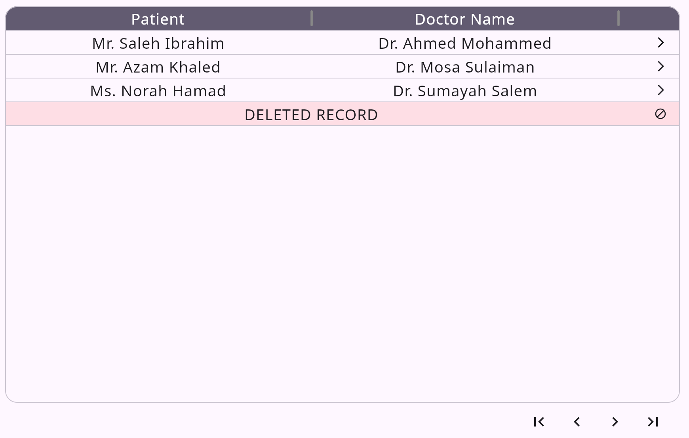

### Compose Table

Create from scratch, a material3 data table for compose multiplatform.
Uses a declarative approach for defining table components (It is like HTML).
Table components can be mixed with arbitrary composables. Table components are
composables and each can take a `Modifier`. Supports both weight-based and
user configurable column widths. Supports horizontal scrolling with an
optional scrollbar.

#### Example:




```kotlin
@Composable
fun Component() {
    Column {
        OutlinedTable(Modifier.defaultMinSize(minHeight = 500.dp)) {
            TableRow(
                Modifier.background(MaterialTheme.colorScheme.secondary),
            ) {
                TableResizableCell(
                    columnWeight = 5,
                    alignment = Alignment.Center,
                ) {
                    Text("Patient", color = MaterialTheme.colorScheme.onSecondary)
                }
                TableResizableCell(
                    columnWeight = 5,
                    alignment = Alignment.Center,
                ) {
                    Text("Doctor Name", color = MaterialTheme.colorScheme.onSecondary)
                }
            }

            HorizontalDivider(Modifier.width(tableInnerWidth))

            listOf(
                "Dr. Ahmed Mohammed" to "Mr. Saleh Ibrahim",
                "Dr. Mosa Sulaiman" to "Mr. Azam Khaled",
                "Dr. Sumayah Salem" to "Ms. Norah Hamad",
            ).forEach { (doctor, patient) ->
                TableRow {
                    TableCell(alignment = Alignment.Center) {
                        Text(patient)
                    }
                    TableCell(alignment = Alignment.Center) {
                        Text(doctor)
                    }
                    TableCell(alignment = Alignment.Center) {
                        Icon(
                            Icons.AutoMirrored.Filled.ArrowForwardIos,
                            contentDescription = "Open",
                            Modifier
                                .height(16.dp)
                                .width(48.dp)
                                .clickable(interactionSource = null, indication = ripple(false, radius = 16.dp)) {}
                                .align(Alignment.CenterEnd)
                        )
                    }
                }

                HorizontalDivider(Modifier.width(tableInnerWidth))
            }

            TableRow(
                Modifier.background(Color.Red.copy(alpha = .1f))
            ) {
                TableSpanCell(
                    alignment = Alignment.Center,
                    columnSpan = 2,
                ) {
                    Text("DELETED RECORD", Modifier)
                }

                TableSpanCell {
                    Icon(
                        Icons.Default.Block,
                        contentDescription = "Can't Open",
                        Modifier
                            .height(16.dp)
                            .width(48.dp)
                            .align(Alignment.CenterEnd)
                    )
                }
            }

            HorizontalDivider(Modifier.width(tableInnerWidth))
        }

        TablePaging(
            Modifier.align(Alignment.End).padding(end = 10.dp),
            pageIndex = 6,
            pageCount = 17,
            onPageChangeRequest = {}
        )
    }
}
```

